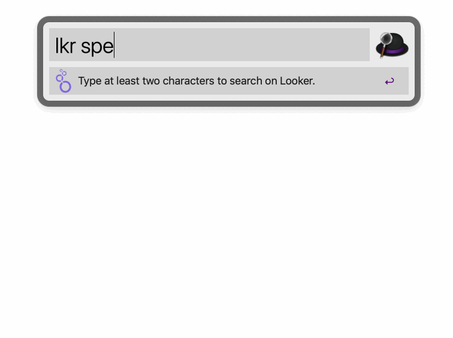

# Search on Looker

An [Alfred Workflow](https://www.alfredapp.com/workflows/) to search on your Looker account. It connects to Looker via the [Looker API](https://docs.looker.com/reference/api-and-integration/api-reference/v3.1).

## Download and Installation

Download the workflow file from [the latest GitHub release](https://github.com/bheltzel/alfred-looker/releases/latest) and install it by double-clicking on `-0.0.1.alfredworkflow`.

## Setup
* Use `lkr > host {looker_host}` to set Looker instance. `lkr > host demo` or `lkr > host demo.au` for example. Do not include full URL.
* Use `lkr > token {looker_token}` and `lkr > secret {looker_secret}` to connect to your Looker API credentials.

## Usage
* Use the keyword `lkr` to search on Looker.

## FAQ
* *Where are my credentials stored?* Host, Token, and Secret are all stored locally on your Apple Keychain under `alfred.looker`.

## Credits

The inspiration and framework for this workflow was taken from the great work on [alfred-salesforce](https://github.com/jereze/alfred-salesforce).